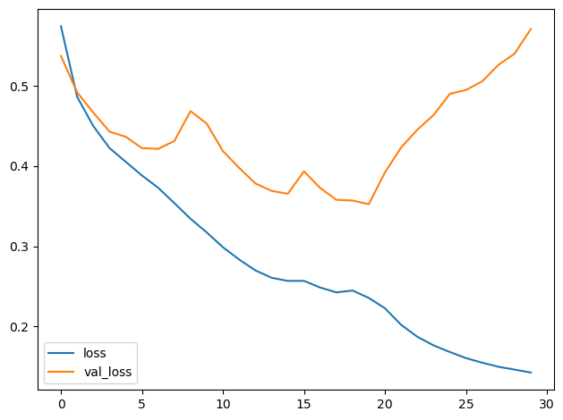
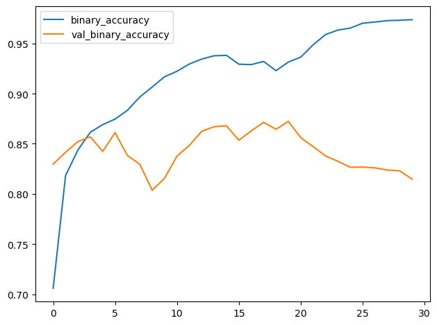

# Computer Vision
## Convolutional neural networks (CNN)
A CNN used for image classification consists of two parts: a convolutional base and a dense head.
The base is used to extract the features from an image. 
It is formed primarily of layers performing the convolution operation, but often includes other kinds of layers as well.
The head is used to determine the class of the image. 
It is formed primarily of dense layers, but might include other layers like dropout.
A feature could be a line, a color, a texture, a shape, a pattern -- or some complicated combination.
## Training the Classifier
The goal of the network during training is to learn two things:
which features to extract from an image (base),
which class goes with what features (head).
These days, convnets are rarely trained from scratch. 
More often, we reuse the base of a pretrained model. 
To the pretrained base we then attach an untrained head. 
In other words, we reuse the part of a network that has already learned to do 
1. Extract features, and attach to it some fresh layers to learn 2. Classify.
Because the head usually consists of only a few dense layers, very accurate classifiers can be created from relatively little data.
Reusing a pretrained model is a technique known as transfer learning. 
It is so effective, that almost every image classifier these days will make use of it.
## Results
Below we examine the loss and metric plots.

## Conclusion
The basic idea behind convolutional classifiers is that we can attach a unit that performs feature engineering to the classifier itself.
This is one of the big advantages deep neural networks have over traditional machine learning models: 
given the right network structure, the deep neural net can learn how to engineer the features it needs to solve its problem.
